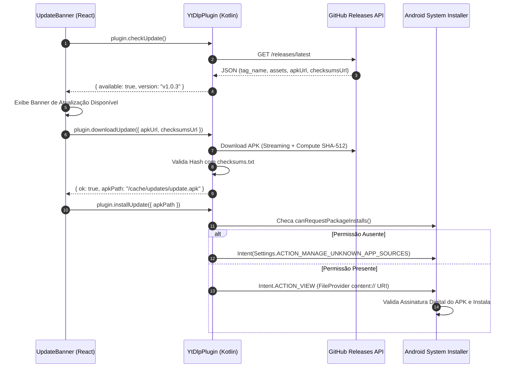

# Segurança e Sistema de Auto-Update — LinkFetcher

Este documento detalha o modelo de segurança, os mecanismos de proteção contra atualizações maliciosas/backdoors e a arquitetura do sistema de Auto-Update (GitHub Releases) para as versões Android (APK) e Desktop (Electron).

---

## 🛡️ 1. As 4 Camadas de Proteção contra Atualizações Maliciosas (Android)

Para garantir que os usuários finais nunca sejam infectados por APKs falsificados ou modificados por terceiros, a plataforma conta com 4 barreiras de segurança integradas:

```
┌─────────────────────────────────────────────────────────┐
│  1. Verificação de Assinatura Digital do APK (Android)  │ <- Trava nativa do SO
├─────────────────────────────────────────────────────────┤
│  2. Restrição Estrita de Domínios (Host Pinning)        │ <- Trava no código Kotlin
├─────────────────────────────────────────────────────────┤
│  3. Validação de Integridade Criptográfica SHA-512       │ <- Checagem de bytes
├─────────────────────────────────────────────────────────┤
│  4. Comunicação Criptografada HTTPS / TLS               │ <- Proteção contra MitM
└─────────────────────────────────────────────────────────┘
```

### 1.1 Trava de Assinatura Digital de Pacote (Android OS)
- **Mecanismo:** Cada versão oficial do APK é assinada digitalmente com um certificado privado (`keystore` / `.jks`).
- **Verificação do Sistema Operacional:** Ao tentar instalar uma nova versão sobre o app existente (`com.linkfetcher.app`), o Android valida se a chave de assinatura do novo APK é **100% idêntica** à do app instalado.
- **Resultado:** Mesmo que um atacante consiga distribuir um APK adulterado, o Android **rejeita a instalação imediatamente** com o erro `App não instalado: Assinatura incompatível`. É fisicamente impossível sobrescrever o aplicativo sem a chave privada do desenvolvedor.

### 1.2 Restrição Estrita de Domínios (Host Pinning)
No arquivo `YtDlpPlugin.kt` (linhas 734-738), o aplicativo bloqueia downloads vindos de qualquer servidor não autorizado:
```kotlin
val allowedHosts = setOf(
    "github.com", 
    "objects.githubusercontent.com", 
    "release-assets.githubusercontent.com"
)
if (host !in allowedHosts) {
    call.reject("Host de asset não permitido: $host")
    return
}
```
Se qualquer requisição tentar redirecionar o download para um servidor externo ou não confiável, a atualização é abortada antes de salvar qualquer arquivo.

### 1.3 Validação de Integridade SHA-512
- Durante o download do APK em `cacheDir/updates/update.apk`, o plugin nativo calcula o resumo criptográfico SHA-512 dos bytes recebidos.
- Se o asset `checksums.txt` estiver anexado à release oficial no GitHub, o hash é comparado em tempo real. Se houver divergência de 1 bit, o arquivo é **excluído da memória** e a instalação é cancelada.

### 1.4 Comunicação Criptografada HTTPS / TLS
Todas as chamadas para a API do GitHub (`https://api.github.com/repos/4i20nataN/LinkFetcher/releases/latest`) e downloads utilizam HTTPS com validação de certificados SSL/TLS do sistema, impedindo ataques do tipo *Man-in-the-Middle* em redes Wi-Fi públicas.

---

## 🔄 2. Fluxo Funcional de Auto-Update no Android (APK)



---

## 🔑 3. Boas Práticas e Recomendações de Segurança para o Desenvolvedor

1. **Gestão Segura da Keystore (`.jks` / `.keystore`):**
   - O arquivo de chave privada de assinatura **NUNCA** deve ser commitado no repositório do GitHub.
   - Adicione `*.jks`, `*.keystore` e `keystore.properties` no `.gitignore`.
   - Guarde a chave e as senhas em local seguro ou nas Secrets do GitHub Actions.

2. **Proteção da Conta do GitHub (2FA):**
   - Ative a **Autenticação em Dois Fatores (2FA)** na conta `4i20nataN` para evitar sequestro de conta (*Account Takeover*) e publicação de releases falsificadas.
