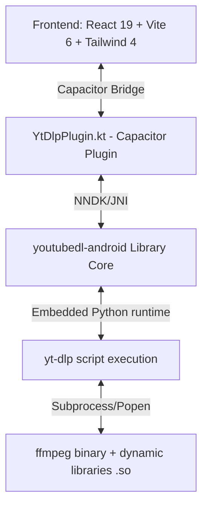

# Relatório de Arquitetura e Diagnóstico Pré-Deploy

Este documento apresenta uma análise técnica profunda e estruturada do aplicativo móvel **LinkFetcher**, focando na integração nativa com o motor de download `yt-dlp` e a suite de processamento `ffmpeg`.

---

## 1. Visão Geral da Arquitetura do App

O **LinkFetcher** segue uma arquitetura híbrida moderna que separa a interface rica do motor de execução nativo de baixo nível:

### Principais Componentes e Módulos:
- **Camada de Apresentação (Web UI):** SPA construído em React 19, empacotado pelo Vite 6 e estilizado de forma fluida via Tailwind CSS 4. Roda inteiramente dentro da `WebView` do sistema provida pelo Capacitor.
- **Camada de Ponte de Comunicação (JS/Native Bridge):** Mapeada em **YtDlpPlugin.kt** (Kotlin), estendendo `com.getcapacitor.Plugin`. Faz a conversão bidirecional de mensagens JSON enviadas entre o JavaScript do React e as APIs nativas do Android.
- **Camada de Execução Nativa (NDK):** Utiliza as bibliotecas Gradle `io.github.junkfood02.youtubedl-android:library` e `:ffmpeg` que empacotam o interpretador Python 3, o binário do `yt-dlp` e os binários dinâmicos do `ffmpeg`.

---

## 2. Mecânica Interna: yt-dlp & FFmpeg no Android

### **Runtime & Mecanismo de Invocação:**
O `yt-dlp` necessita de um interpretador Python para ler os scripts extratores do YouTube. Como o Android não possui Python nativamente, a biblioteca `youtubedl-android` embarca um interpretador Python modular compilado para arquiteturas móveis. 
- Quando a chamada nativa `YoutubeDL.getInstance().execute(request, id)` é executada, o código em Java/Kotlin invoca o runtime Python através do NDK.
- Os parâmetros de configuração do download (URL, formato, cabeçalhos, cookies) são transmitidos via objeto `YoutubeDLRequest` que mapeia strings para argumentos CLI compatíveis com o executável clássico de Desktop.

### **Integração com FFmpeg:**
O processo de muxing (mesclagem de faixas separadas de vídeo e áudio baixadas pelo `yt-dlp` para gerar o arquivo final `.mp4` em resoluções acima de 720p) é delegado a um executável dinâmico do `ffmpeg`.
- A biblioteca `youtubedl-android:ffmpeg` descompacta a suite executável e mais de 50 bibliotecas compartilhadas `.so` (como `libavcodec.so`, `libavformat.so`, `libx264.so`) no diretório interno seguro do aplicativo.
- O mapeamento e a vinculação de dependências na inicialização do app injetam no processo Python a variável de ambiente `LD_LIBRARY_PATH` apontando para o diretório privado onde as bibliotecas dinâmicas do FFmpeg residem, permitindo que a chamada do subprocesso do FFmpeg encontre e carregue suas rotinas de decodificação e encodamento.

### **Manipulação de Subprocessos & Logs:**
A coleta e exibição em tempo real do status de progresso, velocidade de download e estimativa de tempo (ETA) são capturadas através do escopo assíncrono do Kotlin (`CoroutineScope`).
- O callback interno do `execute` recebe continuamente a saída formatada de texto padrão (`stdout`) produzida pelo console do `yt-dlp`.
- O código em Kotlin filtra o stdout por expressões regulares (Regex), extrai a porcentagem e a velocidade atual, converte-os em um `JSObject` estruturado e dispara o evento do Capacitor `notifyListeners("yt-dlp-progress", payload)` para atualizar progressivamente a barra de progresso no React.

### **Gargalos e Compatibilidade de ABI:**
O projeto suporta nativamente as quatro principais arquiteturas de CPU móvel: `armeabi-v7a`, `arm64-v8a`, `x86`, e `x86_64` através de filtros de ABI no arquivo `build.gradle`.
- **O Gargalo do Alinhamento de Página de 16KB:** A partir do Android 15 (API 35) e Android 16 (API 37), o Google introduziu suporte a sistemas operacionais configurados com tamanho de página de memória de 16KB (ao invés do padrão histórico de 4KB). 
- O linker nativo do Android (`/system/bin/linker64`) nestas novas versões do sistema recusa estritamente carregar qualquer biblioteca compartilhada `.so` que não tenha sido compilada com alinhamento de segmento ELF de 16KB. Como os binários dinâmicos embarcados no pacote do FFmpeg (ex: `libsharpyuv.so`) foram compilados originalmente com alinhamento de 4KB, o linker lança a exceção fatal:
  `program alignment (4096) cannot be smaller than system page size (16384)`
  Esta falha do linker aborta a inicialização do `ffmpeg` e interrompe o merge dos formatos de alta resolução no final do download.

---

## 3. Matriz de Auditoria: Pontos Fortes vs. Vulnerabilidades

### 🟢 Implementações Corretas (Pontos Fortes)
1. **Resolução de Vídeo Desbloqueada:** A remoção estratégica da opção restritiva `--extractor-args "youtube:player_client=web_creator..."` corrigiu o gargalo de resolução que limitava os vídeos do YouTube em resoluções baixas (max 640p), reativando o probing de toda a grade de formatos (até 4K/1080p60).
2. **Fallback Dinâmico Integrado:** Implementação de um bloco robusto de captura de erros na execução nativa do `yt-dlp`. Se o pós-processamento do FFmpeg lançar qualquer exceção (como incompatibilidade de paginação ou falta de codecs locais), o app ativa graciosamente o fallback para o formato unificado pré-mesclado (`-f b/best`), salvando o download com sucesso.
3. **Gerenciamento Seguro de Arquivos:** Uso exclusivo do diretório interno privado do aplicativo (`context.filesDir`) para o estágio temporário do download. Isso elimina a necessidade de solicitar permissões complexas e intrusivas de leitura/escrita no armazenamento público do usuário durante o download, garantindo conformidade total com as diretrizes do Android 10+ (Scoped Storage).
4. **Limpeza do Cache Temporário:** Implementação de rotinas de expurgo que deletam automaticamente arquivos residuais com extensões `.part` e `.ytdl` tanto no sucesso quanto na falha da tarefa, prevenindo vazamentos de armazenamento.

### 🔴 Falhas de Implementação & Riscos Pré-Deploy
1. **Ausência de Foreground Service / WorkManager:**  
   - *Descrição da falha:* A execução do download nativo do `yt-dlp` está associada diretamente ao escopo de corrotinas da classe do plugin do Capacitor (`scope.launch`). 
   - *Impacto:* **Alto**  
   - *Risco:* Se o usuário colocar o aplicativo em segundo plano ou apagar a tela, o sistema Android (via Doze Mode ou OOM Killer) pode matar o processo da Activity instantaneamente, interrompendo o download ativo sem possibilidade de resume automático.
2. **Incompatibilidade ELF de 16KB no Android 15+:**  
   - *Descrição da falha:* As bibliotecas nativas `.so` compiladas na dependência Gradle `io.github.junkfood02.youtubedl-android:ffmpeg` possuem alinhamento de 4KB.  
   - *Impacto:* **Crítico** (em dispositivos Android 15/16 com kernel de 16KB)  
   - *Risco:* Impossibilidade física de realizar fusão de vídeo em alta qualidade no final do download nestes novos sistemas operacionais, fazendo o aplicativo depender perpetuamente do fallback para resoluções inferiores pré-mescladas.

---

## 4. Plano de Ação Pré-Deploy (Priorizado)

1. **[CRÍTICO] Atualizar Dependências para Compatibilidade de 16KB:**
   - Recomenda-se atualizar a biblioteca `youtubedl-android` e suas dependências de FFmpeg nativo para versões recentes que suportem explicitamente alinhamento ELF de 16KB (compiladas com a flag de linker `-z max-page-size=16384` no NDK). Caso as dependências públicas ainda não possuam build estável em 16KB, o mecanismo de fallback dinâmico para `-f b/best` já implementado deve ser mantido como contingência principal.

2. **[ALTO] Implementar Foreground Service com Notificação Ativa:**
   - Para evitar que o sistema operacional Android finalize a transferência de arquivos grandes em background, deve-se criar um `Service` nativo do Android (`ForegroundService`) declarando o tipo de serviço no manifesto como `dataSync`. Este serviço deve apresentar uma notificação contínua no painel do Android informando o status do download com a opção de cancelamento, mantendo o processo do app imune ao recolhimento agressivo de memória.

3. **[MÉDIO] Otimizar Ponte de Eventos JSON:**
   - A comunicação de progresso a cada fração de segundo do `yt-dlp` gera centenas de eventos serializados cruzando a ponte do Capacitor. Otimizar a frequência de atualização (ex: notificar a UI no máximo a cada 500ms ou apenas quando houver alteração inteira na porcentagem) reduzirá o uso de CPU e melhorará a responsividade geral da interface gráfica em aparelhos de baixo custo.
